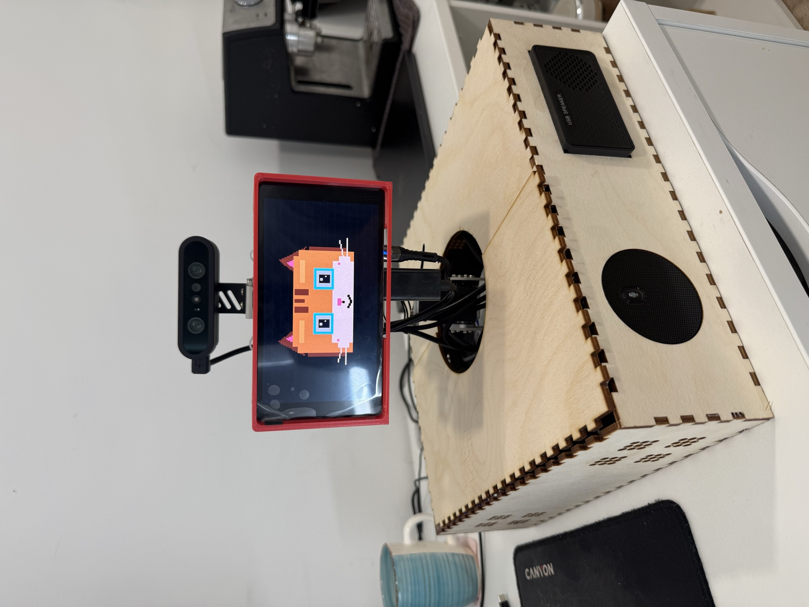
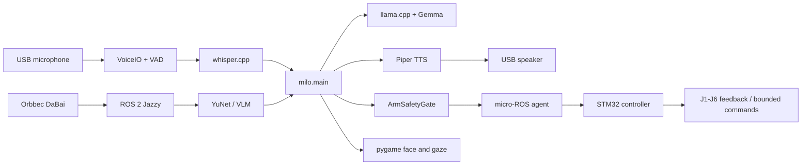

# MILO Stage 2: Jetson-Only Companion



[](https://github.com/vladromenko/Jetson_Friend/actions/workflows/tests.yml)
[](docs/EVOLUTION.md)

This repository preserves the final **single-computer MILO RC13** architecture.
An NVIDIA Jetson Orin Nano owns every part of the robot: local dialogue and
vision models, speech input/output, RGB-D camera, animated face, memory, ROS 2,
and feedback-gated arm tracking.

It is a complete runnable system, not abandoned code. It is also the second
documented stage of the project:

1. [`pi_friend_hat-2`](https://github.com/vladromenko/pi_friend_hat-2): offline
   voice-assistant prototype on Raspberry Pi and Hailo.
2. **Jetson Friend (this repository):** the first complete embodied MILO on one
   Jetson.
3. [`MILO`](https://github.com/vladromenko/MILO): the current distributed Jetson
   brain + Raspberry Pi/Hailo body platform.

Use this repository when the robot must run from **Jetson alone**. Use the main
MILO repository for the current two-computer installation.

> **Status:** reproducible architecture milestone and optional fallback runtime.
> The accepted RC13 behavior is retained. This is a research prototype, not a
> safety-certified robot controller.

## Stage 2 Demo

These recordings show the Jetson-only system in its original Stage 2 enclosure,
with the portrait face display, arm-mounted RGB-D camera, speakers, and animated
gaze:

- [Full movement sequence (1:29, MP4)](media/milo-stage2-demo-01.mp4)
- [Animated face and enclosure (0:27, MP4)](media/milo-stage2-demo-02.mp4)

The repository copies retain the complete recordings and are encoded as
browser-compatible H.264. Personal phone and location metadata has been removed.

## Capabilities

- Local Gemma multimodal conversation through llama.cpp
- Local Whisper speech recognition and Piper speech synthesis
- Orbbec DaBai RGB-D acquisition through ROS 2
- YuNet face detection with ONNX/Haar fallback
- Feedback-gated J1/J3 face tracking and a bounded startup posture
- Animated cat face with gaze aligned to camera coordinates
- Local visual questions and last-seen object-location memory
- Proactive, LLM-generated social prompts
- One-folder installation, manual lifecycle, diagnostics, and restore checks

## Architecture



See [Architecture](docs/ARCHITECTURE.md) for startup and request flows.

## Validated Hardware

- NVIDIA Jetson Orin Nano, 8 GB
- Ubuntu 24.04, CUDA-capable Jetson stack, ROS 2 Jazzy
- Orbbec DaBai RGB-D camera
- Yahboom M3Pro six-axis arm, STM32 controller, CP2104 serial bridge
- UM02 USB microphone and UACDemo USB speaker
- Portrait HDMI/DisplayPort screen

All peripherals connect directly to Jetson in this stage. See
[Hardware](docs/HARDWARE.md) for ports, ownership, and constraints.

## Install

```bash
git clone https://github.com/vladromenko/Jetson_Friend.git ~/Jetson_Friend
cd ~/Jetson_Friend
git checkout jetson-only-v1.0.2
./install.sh
```

The installer creates `.venv`, downloads checksum-verified models, builds pinned
CUDA and ROS dependencies, installs a disabled user service, and runs the test
suite. It finishes with MILO stopped and does not flash the arm controller.

Full prerequisites and first commissioning: [Installation](docs/INSTALLATION.md).

## Run

```bash
cd ~/Jetson_Friend
./install.sh --check   # read-only software/dependency verification
./diagnose.sh          # device and ROS report; does not send motion
./start_milo.sh        # attached foreground run
```

Stop with `Ctrl+C`, or from another terminal:

```bash
cd ~/Jetson_Friend
./stop_milo.sh
```

MILO does not start at boot. The optional `milo.service` remains disabled after
installation. Read [Operation](docs/OPERATION.md) before the first powered test.

## Tests

```bash
python3 -m venv --system-site-packages .venv
.venv/bin/pip install -r requirements.txt -r requirements-dev.txt
.venv/bin/python -m pytest -q -p no:cacheprovider
```

Tests cover configuration invariants, intent routing, audio filtering, LLM
response parsing, camera decoding, gaze, startup stepping, face tracking, and
arm safety. CI never opens hardware or sends motion commands.

## Repository Map

```text
milo/                  Jetson-only application runtime
ros_ws/                pinned ROS dependencies and custom arm messages
scripts/               system, ROS, model, and display setup
tests/                 hardware-free regression suite
docs/                  architecture, installation, operation, and evolution
media/                 Stage 2 hardware image and demonstration recordings
config.env.example     reviewed hardware/runtime configuration
install.sh             install or verify without starting MILO
start_milo.sh          supervised foreground launcher
stop_milo.sh           clean shutdown helper
```

Models, build products, virtual environments, logs, local configuration, and
object memory are intentionally excluded from Git.

## Documentation

- [Architecture](docs/ARCHITECTURE.md)
- [Hardware](docs/HARDWARE.md)
- [Installation](docs/INSTALLATION.md)
- [Operation and troubleshooting](docs/OPERATION.md)
- [Testing](docs/TESTING.md)
- [Project evolution](docs/EVOLUTION.md)
- [Runtime layout](docs/RUNTIME_LAYOUT.md)
- [Restore checklist](docs/RESTORE_CHECKLIST.md)

## Safety and Privacy

Keep access to the arm power cutoff, clear its path, and commission movement with
an observer. J6 is never commanded by MILO. Object memory remains local; models
and runtime data are not committed. Software limits are not a physical safety
system.

## Acknowledgements

MILO was developed during the Innovation Workshop at Skoltech. Core software,
systems integration, and hardware implementation were led by Vladislav Romenko,
with project contributions from Mohamed Khalid Humaid Al Abri, Syed Ali,
Bogdan Permin, and Anastasiia Sukhanovskaia.

---

Stage 2 records the point where MILO first became a complete embodied companion
on one Jetson before its responsibilities were distributed across two computers.
