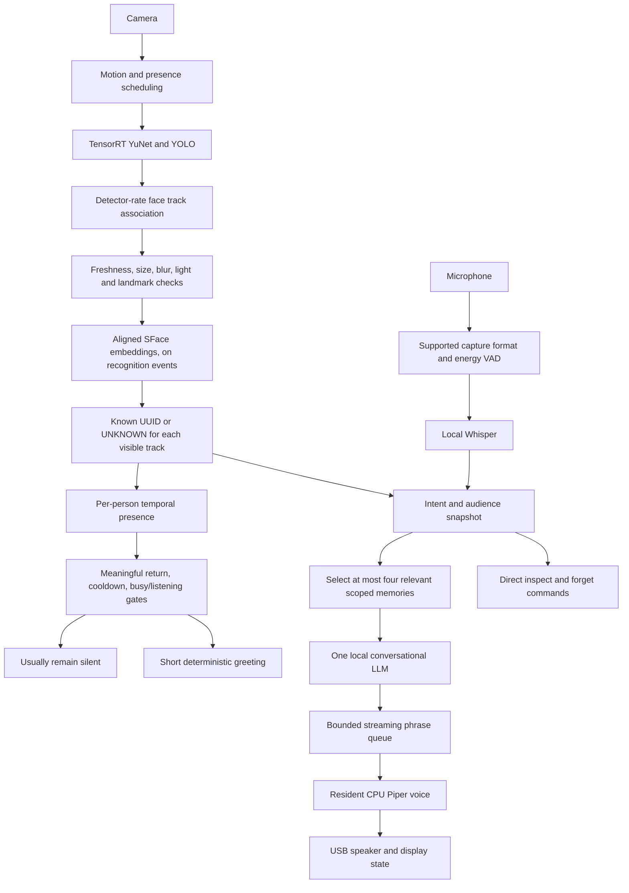

# MILO core implementation and Jetson validation

Date: 2026-09-11. Runtime: `vlad@192.168.0.177:/home/vlad/Jetson_Friend`.

This change makes perception, identity, presence, and conversational memory separate responsibilities. It does not certify face recognition accuracy or long-term unattended operation. Measurements below are short hardware tests, not population-level model evaluations.

## Final flow



Ordinary detections never invoke the LLM. An explicit visual question may load the existing Qwen2.5-VL model after unloading the conversational model. Missing camera frames produce an unavailable response, rather than a text-model visual guess. Generic phrases such as “see you later” no longer trigger a VLM load.

## Correctness and persistence

- Startup begins with no active person. A previous SQLite `current_person_id` is not evidence that the same person is present now.
- Personal reads and writes require an explicit, valid UUID. Passing `None` cannot silently select the last user. Display names can repeat; onboarding never authenticates someone by name.
- Conversation history is keyed by UUID, bounded, and omitted for unknown users. Name confirmation from the newer Jetson implementation is preserved. Confirmation expires and is tied to the current interaction.
- Multiple visible faces can receive separate recognition results. Personal conversation context is withheld when more than one face is visible; the microphone does not identify its speaker. The system cannot guarantee that a lone visible person is the person speaking off-camera.
- Cached face crops are made from detector-matched frames, expire after one second, and are cleared on capture loss. They are not continually refreshed by cropping new frames with old boxes.
- Presence uses `VISIBLE → TEMPORARILY_LOST → ABSENT`, with a one-second appearance confirmation and five-second absence confirmation by default. Brief losses do not generate return greetings. State and cooldowns are per person.
- The default policy is silence. Only a confirmed long return is eligible for a greeting; there are quiet-time, audience, listening, and cooldown checks. Merely detecting a phone or laptop no longer produces assertions about how long someone has used it.
- LLM startup failure no longer prevents the rest of the application from starting. Requests can retry a failed local server. The normal-launch test exposed an unsupported 44.1 kHz capture request and a rapid retry loop. This was fixed: microphone failures now back off, and capture format is checked, negotiated and cached. The subsequent launch opened the C920 without that retry loop. A file lock prevents duplicate robot instances.

## Performance

The original configuration was Qwen3-4B Q4_K_M, 24 GPU layers, 2,048 context, Whisper small.en, JSON replies, and a new Piper process for each reply. The Mac checkout's older configuration was not used as the runtime baseline.

| Metric | Before | After / tested result |
|---|---:|---:|
| LLM cold prompt evaluation, 43-token test | 296 ms | 134 ms |
| LLM first token, three short prompts | 326–637 ms | 106–166 ms |
| LLM generation | 8.9–11.8 tokens/s | 16.9–18.4 tokens/s |
| Application JSON greeting | 5.46 s | 2.45 s with shorter prompt and full offload |
| Standalone Piper, fixed synthetic sentence | 2.89 s per CLI invocation | 0.28–0.74 s synthesis after resident voice load |
| Piper one-time resident load | not applicable | 2.35 s; about 182 MiB process peak RSS in isolated test |
| Whisper base.en, synthetic clips | 1.54 s in initial run | approximately 0.98–1.40 s in later isolated runs |
| Whisper small.en, synthetic clips | 1.94 s in initial run | approximately 1.79–2.31 s in later isolated runs |
| Text request → playback process launch, with camera/TensorRT | not measured | 0.62–0.68 s, two streamed replies |
| Ready synthetic audio buffer → playback launch, with vision | not measured | 1.32–1.99 s, two complete pipeline tests |
| Same audio-buffer test → reply playback finished | not measured | 6.81–7.64 s |
| Capture during empty-scene test | not measured | about 26 FPS |
| Capture during full pipeline test | not measured | about 22–23 FPS |
| Empty-scene face / object inference | fixed/activity-dependent old code | about 1.1 Hz faces; one object call in five seconds |
| Representative live YuNet / YOLO inference | not measured | about 11–12 ms / 16 ms after warmup; first YOLO call about 51 ms |

These figures do not include microphone endpointing in the synthetic-buffer tests. Playback launch is a software proxy, not a measured first acoustic sample. Different response lengths affect total generation and playback time. One later TTS phrase took 2.48 seconds in the integrated run: warm-path latency is not uniformly low.

The synthetic STT clip was synthesized separately for some runs, so transcription outputs are smoke tests, not a controlled speech-recognition accuracy comparison. Both Whisper models occasionally misheard the synthetic phrase. Base.en is the current latency-oriented default; small.en remains installed for an accuracy evaluation with representative real speech.

Raw measurements: [baseline](../artifacts/baseline.json), [full GPU offload](../artifacts/offload99.json), [final 4B prompt](../artifacts/final4b.json), [resident Piper](../artifacts/piper_resident.json), [live streaming](../artifacts/live_stream.json), [whole pipeline](../artifacts/whole_turn.json), [camera/microphone check](../artifacts/perception.json).

### Resources and build

The actual device reported 7,485 MiB unified RAM, MAXN_SUPER power mode, TensorRT 10.16.2.10, OpenCV 4.6.0, and CUDA 13 runtime linkage. llama.cpp commit: `d344123fe2de081a72e02d6869360dfcbc0b528b`; Whisper commit: `a2b36eb677918d4f9ab1db7b8a7ff968563ed163`. llama.cpp was built in Release mode with CUDA, flash attention support, and CUDA graphs enabled.

The baseline benchmark peaked at 5,652 MiB system RAM. The final 4B benchmark peaked at 6,557 MiB; the complete vision/voice run peaked at 6,445 MiB. The runs include different workloads and system states, including a reboot between some runs, so these are observed peaks rather than a controlled memory delta. GPU load reached 99% during bursts; full-pipeline sampling averaged about 16% across startup, synthesis and playback.

Swap grew during several workload runs (the whole-pipeline sample went from 287 to 657 MiB). Subsequent normal-launch steady-state `vmstat` samples showed zero swap-in/out, but this does not establish freedom from swap stalls under sustained load. Observed temperatures were approximately 49–54°C in the sampled windows; prolonged thermal/throttling behavior remains untested.

## Identity

SFace is already installed and loads on the Jetson through OpenCV. The new path aligns faces using YuNet's five landmarks; the previous path merely resized a crop. References from that old representation remain on disk but are excluded from the new matcher using `representation='sface-aligned-v1'`. Existing profiles may therefore need deliberate re-enrollment; unaligned and aligned vectors must not be mixed.

The live test confirmed 128-dimensional SFace embeddings. The current cosine-score threshold is 0.46 with a mandatory 0.06 separation from the second-best person, even for a strong match. These are provisional settings, not a calibrated probability. At least three references are required. Up to twelve active references are retained per person. Weak, ambiguous, unavailable, or stale observations remain UNKNOWN.

Enrollment requires an explicitly created UUID, one stable track, multiple fresh high-quality samples, and consistency across the collection. A changed track aborts collection. Automatic reinforcement is not used by the runtime; a mistaken recognition must not silently teach itself a new face.

Face quality uses minimum size, blur, brightness, detection confidence, roll and nose-position heuristics. It does not reliably estimate occlusion or full 3D pose. The simple IoU associator deliberately abandons ambiguous crossings; it is not ByteTrack, SORT, optical-flow tracking, or a measured identity-switch solution. Continuous tracking and calibrated recognition require labeled live tests.

A subsequent 45-second live face test collected five references, then matched all 53 later validation frames to the temporary profile. Embedding latency was 36.95–47.77 ms (median 40.37 ms); SQLite/cosine matching took a median 4.06 ms. Similarity ranged from 0.9226 to 0.9724. Capture held about 26 FPS, with no rejected quality frames or multiple faces during the sampled session. The temporary profile and embeddings were removed after the test, and no camera images were saved. [Raw live-face measurements](../artifacts/live_face_test.json).

This validates positive repeat recognition in one session. It does not measure false acceptance against other people, long-absence recognition, occlusions, crossing tracks, or recognition latency while the LLM is generating. Recognition thresholds and multi-person identity-switch accuracy remain uncalibrated.

## Memory

The active schema retains `persons`, `person_profiles`, `memories`, `temporary_states`, `objects`, `events`, `settings`, and `person_face_embeddings`. Personal entries use UUID `person_id`; object ownership is optional. Relationships and deletion are enforced by application operations on the existing SQLite schema rather than a wholesale foreign-key migration.

Semantic facts, preferences, goals, episodes and relationships have distinct memory kinds. Temporary emotional context has a separate expiring table. Conversational working history stays bounded in RAM. Object memory updates on class appearance transitions, not once every thirty seconds; instance-level object movement and spatial locations are not implemented.

The runtime accepts a conservative set of explicit facts, preferences, study goals and scheduled events, plus explicit “remember” requests. It ignores acknowledgements, ordinary small talk, private-turn instructions and temporary moods for permanent storage. It does not trust the conversational LLM to decide what becomes a durable fact. Explicit emotional statements can update ten-minute temporary context. Visual emotion inference is off by default.

Retrieval uses lexical relevance, type, importance, confidence and recency, filtered in SQL to the current person and explicitly global entries. Normal retrieval returns four items from a bounded candidate set. Legacy NULL-person rows are not automatically public or reassigned on every restart. Global writes require the explicit API source `global`.

Normalization deduplicates punctuation/case variants. A keyed scheduled-event update supersedes an older date for the same type of event and person. Arbitrary paraphrase consolidation and multiple different exams with the same category need more sophisticated handling; no vector database or retrieval model was added.

“What do you remember about me?”, “Forget that”, and “Forget everything about me” are handled directly. Profile deletion removes that person's active-database memories, episodes, temporary state, preferences and face vectors, and clears runtime history. Explicit “Remember that …” requests are acknowledged directly only after the scoped write succeeds; unknown users are told identification is needed. “Don't remember this” suppresses saving and history for that turn. Existing external backups and legacy photo files are not securely erased by database deletion.

## Models and decisions

| Model | Quantization | Observed short generation | Decision |
|---|---|---:|---|
| Qwen3-4B | Q4_K_M | about 17–18 tokens/s at full offload | Keep as conversational default |
| Qwen3-1.7B | Q4_K_M | about 32–36 tokens/s | Installed candidate; not default |
| Qwen2.5-VL-3B | Q4_K_M, existing projector | not benchmarked here | Existing on-demand visual path |
| Qwen3.5-2B | not downloaded | not measured | Candidate for later quality/build evaluation |

The 1.7B test was faster and used less system RAM (4,977 MiB peak in its benchmark), but it used “I prefer” for a user's preference and invented a happy mood in response to a neutral greeting. These few examples do not constitute an overall quality ranking; they are enough to avoid switching the companion's default solely on token speed. [Candidate results](../artifacts/candidate17b.json).

There is one resident conversational model, not a fast/smart dual-model router. Quantization comparisons were not run. Context is kept at 2,048 for short interaction with bounded history and retrieved memory; 3,072/4,096 were not benchmarked. Full GPU offload was measured independently before adoption. A follow-up `--ubatch-size 128` test preserved short-prompt latency (about 105–165 ms to first token, 16–18 tokens/s) and observed a 5,958 MiB system RAM peak with swap changing by only 4 MiB. The system state differed, so this is not a controlled memory savings figure. The smaller microbatch is retained as a bounded-workspace setting for short requests. [Microbatch test](../artifacts/ubatch128.json). Other CPU/KV/cache/mmap/affinity parameters are not claimed as tuned.

The installed llama.cpp help exposes `--reasoning-budget` and chat-template controls. Requests use `enable_thinking=false`; the tested command also uses `--reasoning-budget 0`. The recorded streamed probes returned no `reasoning_content` and no thought tags. The runtime refuses to speak explicit reasoning/protocol output. This verifies those probes on this build/model, not every possible prompt or model.

## Reproduce and operate

```bash
cd /home/vlad/Jetson_Friend
set -a
. ./config.env
set +a
.venv/bin/python -m pytest -q
.venv/bin/python tools/benchmark_core.py --output artifacts/recheck.json
.venv/bin/python tools/check_perception.py
.venv/bin/python tools/benchmark_turn.py
./start.sh
```

Stop MILO before running a server-parameter benchmark: an existing server may be reused and would invalidate a parameter comparison. Benchmark tools use synthetic prompts/audio and keep camera frames in RAM on the Jetson. Runtime timings go to `data/latency.jsonl` without transcripts, names or embeddings. Server diagnostics remain local in `data/llama-server.log`.

Reproducible conversational server settings:

```bash
deps/llama.cpp/build/bin/llama-server \
  -m models/llm/Qwen3-4B-Q4_K_M.gguf \
  --host 127.0.0.1 --port 8081 \
  -c 2048 -ngl 99 --flash-attn on --parallel 1 --reasoning-budget 0 --ubatch-size 128
```

An on-device backup of the original source, configuration, and SQLite database was made at `.milo_core_backup_20260911_050649`. The original Jetson name-confirmation change was incorporated before deployment. The existing `miloctl` model-selection commands were repaired to call the correct manager and pass the model ID as an argument.

## Working versus remaining

The final normal launcher was restarted successfully with camera and microphone selected and zero startup error lines. MILO was left running on the Jetson. [Startup validation](../artifacts/runtime_validation.json).

After startup, a live spoken request exposed a speaker conflict: PipeWire owned the USB output while MILO tried exclusive ALSA playback (`Device or resource busy`). Device-name selection now prefers the matching shared PipeWire sink, with ALSA fallback when no audio server is available. A synthesized phrase played without reported errors while the pygame mixer was active. Physical audibility still needs user confirmation. The restarted runtime log is `artifacts/runtime_audio_fix.log`.

Working and exercised: local model inference, actual TensorRT camera detection, single-person live face matching, webcam microphone capture, USB speaker playback, streamed phrase generation, resident Piper, full synthetic audio pipeline, scoped memory operations, and normal startup with the display. The 35 automated regression tests passed on both the Mac and Jetson and cover identity boundaries, presence hysteresis, conservative policy, deletion, stale crops, streaming errors, retrieval, microphone format negotiation and shared speaker selection.

Remaining: multi-person calibration and longer-term identity/enrollment validation; speaker association; optical-flow/continuous tracking; broader memory paraphrase/conflict handling; robust object-instance and spatial memory; reliable acoustic barge-in; sustained thermal and memory-pressure testing; more varied speech/model quality evaluation. No mobility, arms, navigation or ROS integration was added.

## Primary references consulted

- [OpenCV SFace implementation](https://github.com/opencv/opencv_zoo/blob/main/models/face_recognition_sface/sface.py): alignment and embedding interface. Its example threshold is not a calibration for this robot.
- [Piper Python API](https://github.com/OHF-Voice/piper1-gpl/blob/main/docs/API_PYTHON.md): resident `PiperVoice` and `synthesize_wav`; the installed Jetson signatures were also inspected.
- [llama.cpp server documentation](https://github.com/ggml-org/llama.cpp/blob/master/tools/server/README.md): reasoning and server controls, checked against local `--help`.
- [Qwen3-1.7B quantization from ggml-org](https://huggingface.co/ggml-org/Qwen3-1.7B-GGUF/blob/main/Qwen3-1.7B-Q4_K_M.gguf): downloaded candidate. SHA-256: `d2387ca2dbfee2ffabce7120d3770dadca0b293052bc2f0e138fdc940d9bc7b5`.
- [Qwen3.5-2B model card](https://huggingface.co/Qwen/Qwen3.5-2B): considered for future evaluation, not benchmarked or selected.
